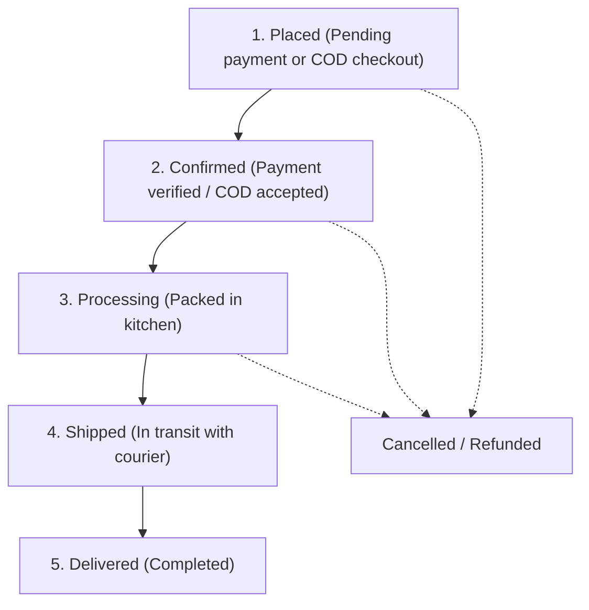

# RV Foods - Business Operations & Admin Guide

Welcome to the operations manual for **RV Foods** ("Pure. Traditional. Delivered."). This guide outlines how to manage inventory, fulfill customer orders, verify payments, moderate reviews, and perform user management through the Admin Panel.

---

## 1. Dashboard Analytics & Monitoring

The Admin Dashboard provides a real-time overview of the business. Use this screen to track performance and monitor store health:
*   **Total Revenue:** Summarizes cash flow from all completed orders (paid Razorpay transactions and delivered Cash on Delivery orders).
*   **Total Orders:** Total count of orders placed in the system.
*   **Total Products:** The number of products currently in the catalog (both active and inactive).
*   **Registered Users:** Count of registered customers and staff accounts.
*   **Revenue Trend (7-day Chart):** An interactive chart tracking daily sales. Use this to identify shopping spikes and weekly trends.
*   **Stock Alerts Panel:** Displays products that are running low (**5 or fewer units left**) or are **Out of Stock**. Monitor this daily to coordinate kitchen refills.

---

## 2. Managing Products & Inventory

You can access product management via the **Products** tab in the Admin Panel sidebar.

### Adding a New Product
1.  Click the **Add Product** button in the top right.
2.  Fill in the required product details:
    *   **Product Name:** A descriptive name (e.g., *Hand-Ground Shahi Garam Masala*).
    *   **Category:** Select the appropriate category (Masale, Ghee, Sweets, Snacks, Combo Packs).
    *   **Weight / Volume:** Specify the selling pack size (e.g., *250g*, *500g*, *1 Liter*).
    *   **Price (₹):** The standard MRP or base selling price.
    *   **Discount Price (₹):** Optional. If filled, the store displays a discount badge showing the savings, and bills customers at this lower price.
    *   **Stock Quantity:** Initial units prepared in the kitchen.
    *   **Short Description:** A 1-sentence hook (maximum 120 characters) displayed on product cards.
    *   **Full Description:** Detail the taste profile, recipe heritage, storage instructions, and prepared methods.
3.  Add list elements:
    *   **Ingredients:** Enter as a comma-separated list (e.g., *Coriander seeds, cumin, black cardamom, cloves*). The system converts this into a bulleted list on the product detail page.
    *   **Health Benefits:** Enter as a comma-separated list (e.g., *Aids digestion, rich in antioxidants, boosts immunity*).
4.  Set status flags:
    *   **Featured Product:** Turn on to display the product on the homepage grid.
    *   **Active Storefront:** Turn off if a product goes out of season or is temporarily unavailable. This hides the product from customer views without deleting it.
5.  Click **Create Product**.

### Managing Product Images (Editing mode only)
To prevent empty files, images are uploaded *after* the product details are initially saved.
1.  Locate the product in the table and click the **Edit** (pencil) icon.
2.  Scroll down to the **Product Images** section.
3.  **Upload images:** Click **Upload Images** and choose up to 5 photos. These are optimized and uploaded securely to Cloudinary.
4.  **Delete images:** Hover over a thumbnail in the image list and click the **X** overlay.

---

## 3. Order Processing & Fulfillment

Customer orders must follow a sequential shipping workflow. Locate orders in the **Orders** tab, click any row to expand details, and update the status dropdown:

### The Order Status Lifecycle

1.  **Placed:** A customer has initiated checkout.
    *   If payment method is **cod**, the system deducts stock immediately and you can proceed to confirm.
    *   If payment method is **razorpay**, the order remains in *placed* until the payment verification webhook executes.
2.  **Confirmed:** The order is validated and queued for packaging.
3.  **Processing:** The kitchen team is currently grinding spices or preparing sweets and packaging the order.
4.  **Shipped:** The package has been handed over to the shipping carrier. The customer is notified of dispatch.
5.  **Delivered:** The courier confirms drop-off. If the order was **COD**, updating status to *delivered* automatically updates the payment status to **paid** and adds the total to your dashboard revenue.

### Cancelling Orders & Refunds
If a customer requests cancellation, or stock is unavailable, change the status dropdown to **Cancelled / Refund**:
*   **Inventory Restocking:** The system automatically returns the items to the inventory pool so stock levels stay accurate.
*   **Automatic Refund Status:** If the order was already paid via Razorpay, the payment status automatically changes to **refunded** for book-keeping tracking.

---

## 4. Review Moderation & Customer Feedback

Reviews help build trust and verify product quality.
*   **Verified Buyer Badge:** If a customer leaves a review for a product they purchased and had delivered, the system automatically appends a green **Verified Buyer** badge to their review.
*   **Deleting Reviews:** If a review contains spam, inappropriate language, or incorrect feedback, any **Admin** can delete it directly from the product detail page by clicking the **Trash** icon next to the review timestamp.

---

## 5. User Registry & Staff Management

The **Users** tab lists all registered users. Use this screen to search users by name or email, filter accounts, and perform roles management:
*   **Verifying Users:** Toggle email verification flags. Set to verified to confirm accounts manually.
*   **Promoting Staff:** Change a user's role by clicking **Promote** to grant them Admin privileges. Administrators have full access to statistics, product configurations, shipping records, and database flags.
*   **Demoting Staff:** Click **Demote** on an admin account to revert them to standard customer privileges.
